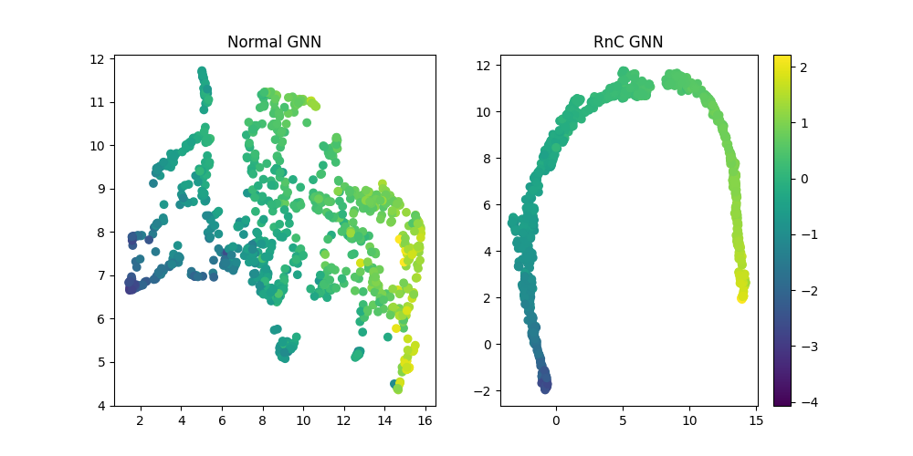
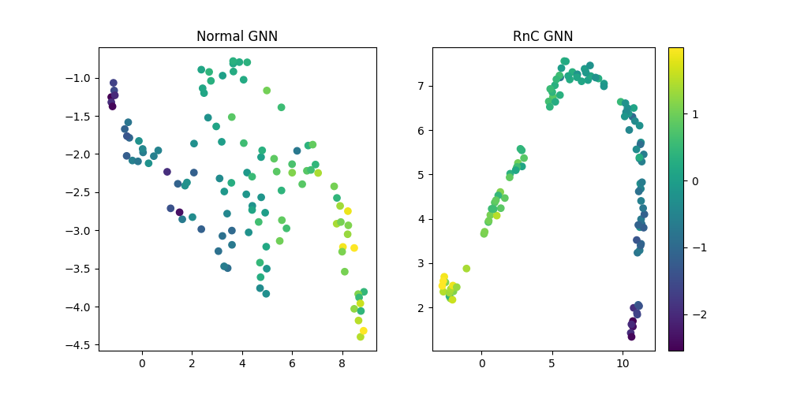

## DL assignment: Rank-N-Contrast

#### NOTE : For CV tasks, a higher python version might go through, but to run all experiments, 3.9.x is recommended.

### Loss Function
#### CV task
The loss function [`RnCLoss`](./loss.py#L34) used for the CV part in [`loss.py`](./loss.py) takes `features` and `labels` as input, return the loss value, and has three hyper-parameters: `temperature`, `label_diff`, and `feature_sim` associated with it.
```python
from loss import RnCLoss

# define loss function with temperature, label difference measure, 
# and feature similarity measure
criterion = RnCLoss(temperature=2, label_diff='l1', feature_sim='l2')

# features: [bs, 2, feat_dim]
features = ...
# labels: [bs, label_dim]
labels = ...

# compute RnC loss
loss = criterion(features, labels)
```

### Running

#### CV task
Download AgeDB dataset from [here](https://ibug.doc.ic.ac.uk/resources/agedb/) and extract the zip file (you may need to contact the authors of AgeDB dataset for the zip password) to folder `./CNN/data`.

- Firstly, change to the CNN folder
    ```
    cd ./CNN
    ```
- To train the model with the L1 loss, run 
    ```
    python main_l1.py
    ```
- To train the model with the RnC framework, first run 
    ```
    python main_rnc.py
    ```
    
    to train the encoder. The checkpoint of the encoder will be saved to `./save`. Then, run
    ```
    python main_linear.py --ckpt <PATH_TO_THE_TRAINED_ENCODER_CHECKPOINT>
    ```
  to train the regressor.

## Apart from the official reproduction, we have also tried out this loss on a Graph Regression Task, the ESOL (publicly available asa subset of MoleculeNet <a href="https://moleculenet.org/datasets-1">here</a>) dataset. <br>

#### The detailed results are available <a href="https://docs.google.com/spreadsheets/d/1HBiUqcsvInXPTq7ywI10QNTG04TnSSEAMmGR4vD-u18/edit#gid=1568203868">here</a> with run plots on my wandb account <a href="https://wandb.ai/karannb/dl-project/table?nw=nwuserkarannb">here</a>. A brief summary is below - 
| Method / Loss | test MAE | test RMSE | test MSE | validation MAE | validation RMSE | validation MSE |
| :-----------: | :------: | :-------: | :------: | :------------: | :-------------: | :------------: |
| normal-L1 | 0.247	| 0.326 | 0.106 | **0.224** | 0.325 | 0.106 |
| RnC(L1) + freeze | **0.219** | **0.297** | 0.088 | 0.255 | 0.359 | 0.129 |
| RnC(L1) | **0.212** | 0.314 | 0.099 | 0.235 | 0.345 | 0.119 |
| RnC(L2) | 0.266 | 0.342 | 0.117 | 0.276 | 0.366 | 0.134 |
| RnC(Huber) | 0.242 | 0.326 | 0.106 | 0.245 | **0.317** | **0.101** |

#### A view on the amazing representation space learned by RnC v/s end-to-end L1,
Training Data

Test Data


#### A sequence of commands to reporduce our results - (can be done completely on the free version of Google CoLab, though you might run into python version issues, some known issues are listed below)
- First create a directory called "data/" and create a subfolder titled "ESOL", then you can create the preprocessed dataset as
    ```python
    python3 -m GNN.preprocess
    ```

- The exact runs can be reproduced by running the 3 scripts, they have already been updated with optimal parameters as the default ones. (Note that, we have done some hyperparameter tuning but not a very rigorous grid search)
    ```python
    python3 -m GNN.main_l1
    python3 -m GNN.main_rnc
    python3 -m GNN.main_linear --ckpt <your_checkpoint_from_rnc> [OPTINAL] --freeze_encoder --loss [l1(default)/MSE/huber]
    ```

- The plots for the representation space can be reproduced using 
    ```python
    python3 -m misc.representation_space
    ```

#### Everything will be by default logged to w&b and so I recommend signing in using (and pasting your API Key)
```bash
wandb login
```
#### Following is a bash script to run on multiple GPUs or slurm clusters - 
```bash
#!/bin/sh

#SBATCH --job-name=GNN
#SBATCH --output=logs/l1_GNN.out
#SBATCH --error=logs/l1_GNN.err
#SBATCH --time=10:00:00
#SBATCH --gres=gpu:2
#SBATCH --mem=128G

export CUDA_VISIBLE_DEVICES=2

cd GNN/

python3 main_l1.py --data_folder data/

# other possible runs are
# python3 main_l1.py --data_folder data/, with output=logs/L1_GNN.out and error=logs/L1_GNN.err
# python3 main_rnc.py --data_folder data/, with output=logs/rnc_GNN.out and error=logs/rnc_GNN.err

# python3 main_linear.py --data_folder data/ --loss [L1(default)/MSE/huber] --ckpt <path> [OPTIONAL] --freeze_encoder, 
# with output=logs/linear_GNN.out and error=logs/linear_GNN.err
```

#### Known issues - 
1. You might not be able to download all PyG dependencies, on a higher python version (> 3.9.19), especially the ones that have a ~cu117~ at the end, **all** experiments can be reproduced without those libraries so feel free to remove them!